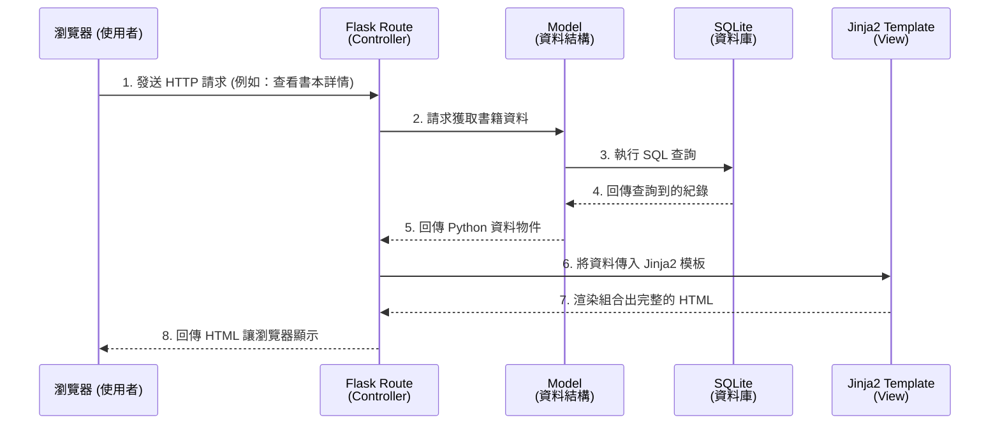

# 系統架構文件

這份文件根據 [產品需求文件 (PRD)](PRD.md) 的規劃，定義了「二手書交換與買賣平台」的系統技術架構、資料夾結構以及各元件之間的互動關係。

## 1. 技術架構說明

本專案依據 PRD 限制，不採用前後端分離，統一由後端伺服器處理邏輯與畫面渲染。

- **選用技術與原因**：
  - **後端 (Python + Flask)**：Flask 是一個輕量、高度可客製化的 Web 框架，學習曲線平緩，非常適合初學團隊快速打造出最小可行產品 (MVP)。
  - **模板引擎 (Jinja2)**：內建於 Flask 中，負責動態生成 HTML。透過樣板繼承與變數替換，能快速地將後端資料轉換為前端畫面，且免去維護複雜的前端框架配置。
  - **資料庫 (SQLite)**：輕量、免安裝伺服器，資料直接存在單一檔案中，非常適合初期開發與測試。
  - **前端 (HTML / CSS / JavaScript)**：負責打造具備現代感與美觀的介面。

- **Flask MVC 模式說明**：
  儘管 Flask 本身不強制規定 MVC，但我們將依循此模式來組織程式碼：
  - **Model (模型)**：負責定義資料的結構與商業邏輯（例如 `User`、`Book` 等），並處理與 SQLite 的互動。
  - **View (視圖)**：負責將資料轉換成使用者可以看到的網頁，這裡由 Jinja2 模板（`.html`）負責。
  - **Controller (控制器)**：由 Flask 的 `Route` (路由) 負責，它會接收使用者的 HTTP 請求，去呼叫對應的 Model 拿資料，最後把資料丟給 Jinja2 模板去渲染出 HTML。

---

## 2. 專案資料夾結構

專案將採取模組化的結構，將不同的功能拆分，方便多人協作：

```text
web_app_development/
├── app/                        # 應用程式主目錄 (核心程式碼)
│   ├── __init__.py             # 建立並初始化 Flask 應用程式 (App Factory)
│   ├── models.py               # 資料庫模型 (定義 User, Book 等資料表)
│   ├── routes.py               # Flask 路由控制器 (定義所有的 URL 與邏輯)
│   ├── templates/              # Jinja2 HTML 模板 (View)
│   │   ├── base.html           # 共同的基礎版型 (包含 Header, Footer)
│   │   ├── index.html          # 首頁 (商品列表預覽)
│   │   ├── auth/               # 登入與註冊相關的模板
│   │   │   ├── login.html      
│   │   │   └── register.html   
│   │   └── book/               # 書籍操作相關的模板
│   │       ├── list.html       # 搜尋結果/所有書籍列表
│   │       ├── detail.html     # 單一書籍詳情頁
│   │       └── edit.html       # 新增/編輯書籍頁面
│   └── static/                 # 前端靜態資源
│       ├── css/                # 樣式表 (負責現代感設計)
│       ├── js/                 # 負責頁面微互動的腳本
│       └── images/             # 網站靜態圖片與使用者上傳的書籍照片
├── instance/                   # 存放運行時的機密設定或本地資料庫
│   └── database.db             # SQLite 資料庫實體檔案
├── docs/                       # 專案文件 (如你現在看到的這份)
│   ├── PRD.md                  
│   └── ARCHITECTURE.md         
├── config.py                   # 環境變數與系統設定檔
├── requirements.txt            # Python 第三方套件依賴清單
└── run.py                      # 系統入口檔案，用於啟動伺服器
```

---

## 3. 元件關係圖

以下圖示說明了使用者從瀏覽器發出請求後，系統內部各個元件是如何互動的：



---

## 4. 關鍵設計決策

以下列出專案架構中 3 個關鍵的技術決策：

1. **採用伺服器端渲染 (SSR) 而非前後端分離**
   - **原因**：為了符合「一週內完成原型 (Prototype)」的時程壓力。Flask 搭配 Jinja2 可以在同一個專案內快速完成頁面開發，免除了處理跨域 (CORS)、API 設計以及設定 React/Vue 等前端建置工具的複雜度，對於初學者團隊是最穩妥的選擇。

2. **圖片上傳採用本地靜態資料夾儲存 (Local Storage)**
   - **原因**：使用者上架書籍時需要上傳照片。初期 MVP 版本為求快速與低成本，不串接 AWS S3 等雲端儲存空間。我們會將照片儲存於 `app/static/images/` 下，並在資料庫記錄相對路徑。同時，會在 `routes.py` 中限制上傳檔案的大小，防止伺服器容量被塞滿。

3. **安全性與權限驗證由 Flask 統一攔截**
   - **原因**：為確保「單純安全的學生交易環境」及「只有擁有者可修改書籍」，我們會實作 `@login_required` 裝飾器。所有需要登入的操作（如上架、留言）都會被統一攔截檢查。密碼部分則會使用 Werkzeug 或 Bcrypt 進行雜湊加密後才存入 SQLite，防止敏感資料外洩。
