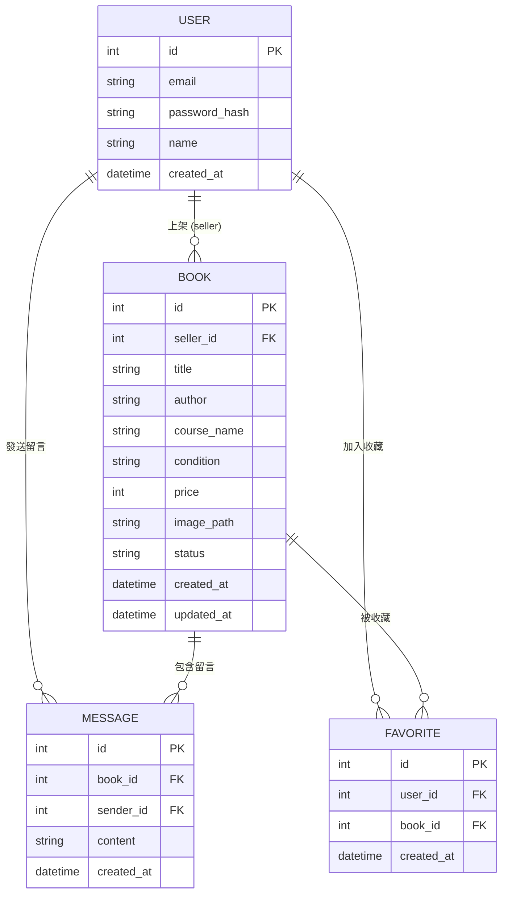

# 資料庫設計文件

本文件根據 PRD 與 FLOWCHART，定義了「二手書交換與買賣平台」的 SQLite 資料庫 Schema、實體關係圖 (ER 圖)，以及資料表的詳細說明。

## 1. ER 圖（實體關係圖）

## 2. 資料表詳細說明

### `users` 資料表 (使用者)
記錄學生的帳號與基本資訊。

| 欄位名稱 | 型別 | 說明 | 限制 |
| :--- | :--- | :--- | :--- |
| `id` | INTEGER | 使用者唯一識別碼 (PK) | PRIMARY KEY, AUTOINCREMENT |
| `email` | TEXT | 登入用的 Email | NOT NULL, UNIQUE |
| `password_hash` | TEXT | 加密後的密碼 | NOT NULL |
| `name` | TEXT | 使用者暱稱或真實姓名 | NOT NULL |
| `created_at` | DATETIME | 帳號建立時間 | DEFAULT CURRENT_TIMESTAMP |

### `books` 資料表 (書籍)
記錄二手書的商品資訊與交易狀態。

| 欄位名稱 | 型別 | 說明 | 限制 |
| :--- | :--- | :--- | :--- |
| `id` | INTEGER | 書籍唯一識別碼 (PK) | PRIMARY KEY, AUTOINCREMENT |
| `seller_id` | INTEGER | 賣家識別碼 (FK 關聯 users.id) | NOT NULL, FOREIGN KEY |
| `title` | TEXT | 書籍名稱 | NOT NULL |
| `author` | TEXT | 作者 | 可為空 |
| `course_name` | TEXT | 適用課程名稱 | 可為空 |
| `condition` | TEXT | 書況描述 (如：全新、有劃記) | NOT NULL |
| `price` | INTEGER | 販售價格 | NOT NULL |
| `image_path` | TEXT | 照片儲存路徑 | 可為空 |
| `status` | TEXT | 交易狀態 (available/reserved/sold) | DEFAULT 'available' |
| `created_at` | DATETIME | 上架時間 | DEFAULT CURRENT_TIMESTAMP |
| `updated_at` | DATETIME | 最後更新時間 | DEFAULT CURRENT_TIMESTAMP |

### `messages` 資料表 (留言板)
記錄買賣雙方針對特定書籍的討論或詢問。

| 欄位名稱 | 型別 | 說明 | 限制 |
| :--- | :--- | :--- | :--- |
| `id` | INTEGER | 留言唯一識別碼 (PK) | PRIMARY KEY, AUTOINCREMENT |
| `book_id` | INTEGER | 討論的書籍 (FK 關聯 books.id) | NOT NULL, FOREIGN KEY |
| `sender_id` | INTEGER | 留言者 (FK 關聯 users.id) | NOT NULL, FOREIGN KEY |
| `content` | TEXT | 留言內容 | NOT NULL |
| `created_at` | DATETIME | 留言建立時間 | DEFAULT CURRENT_TIMESTAMP |

### `favorites` 資料表 (收藏清單)
記錄使用者收藏的書籍 (加分項功能)。

| 欄位名稱 | 型別 | 說明 | 限制 |
| :--- | :--- | :--- | :--- |
| `id` | INTEGER | 收藏紀錄唯一識別碼 (PK)| PRIMARY KEY, AUTOINCREMENT |
| `user_id` | INTEGER | 收藏者 (FK 關聯 users.id) | NOT NULL, FOREIGN KEY |
| `book_id` | INTEGER | 被收藏的書籍 (FK 關聯 books.id)| NOT NULL, FOREIGN KEY |
| `created_at` | DATETIME | 收藏建立時間 | DEFAULT CURRENT_TIMESTAMP |

## 3. SQL 建表語法與 Model

- SQL 建表語法請見：`database/schema.sql`
- SQLAlchemy Models 請見：`app/models/` 目錄下的 Python 檔案
