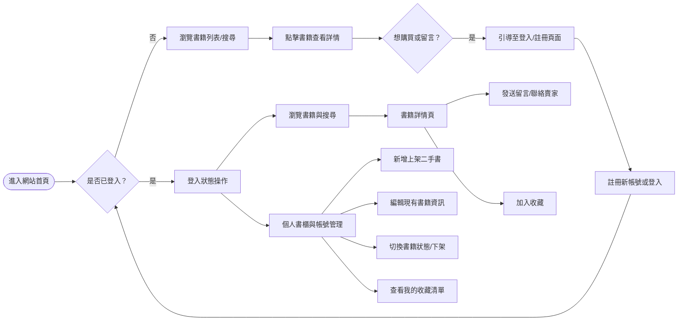
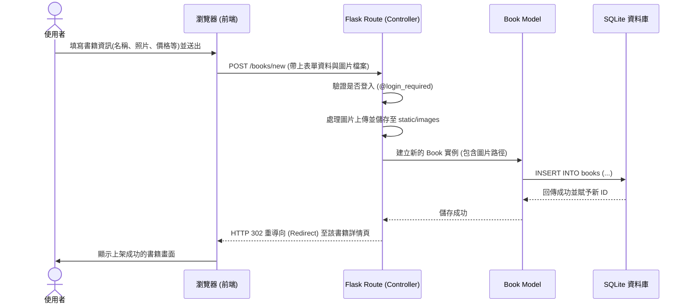

# 流程圖文件

本文件依據 PRD 與系統架構文件，視覺化使用者操作路徑與系統資料流，幫助開發團隊釐清網站互動與資料處理流程。

## 1. 使用者流程圖（User Flow）

呈現使用者從進入首頁後，各種主要功能的操作路徑。

## 2. 系統序列圖（Sequence Diagram）

以下序列圖描述「使用者上架一本二手書」時，從前端表單送出到資料存入資料庫的完整互動流程。

## 3. 功能清單對照表

將 PRD 中的功能需求對應至網站的 URL 路徑與 HTTP 方法，作為後續開發路由（Routes）的依據。

| 功能區塊 | 功能說明 | HTTP 方法 | URL 路徑 | 說明 |
| :--- | :--- | :--- | :--- | :--- |
| **首頁與探索** | 首頁 / 最新書籍列表 | GET | `/` | 預設顯示最新上架的書籍 |
| | 書籍搜尋與列表 | GET | `/books` | 可透過 `?q=關鍵字` 參數進行搜尋 |
| | 書籍詳情頁 | GET | `/books/<int:id>` | 顯示單一書籍的詳細資訊與留言 |
| **會員認證** | 註冊帳號 | GET / POST | `/auth/register` | 填寫學生資訊並建立帳號 |
| | 登入系統 | GET / POST | `/auth/login` | 驗證密碼並建立 session |
| | 登出系統 | GET | `/auth/logout` | 清除 session |
| **書櫃管理** | 個人頁面與我的書籍 | GET | `/profile` | 顯示自己上架的書籍與基本資料 |
| | 新增二手書 | GET / POST | `/books/new` | 顯示表單 / 接收資料並存檔 |
| | 編輯書籍資訊 | GET / POST | `/books/<int:id>/edit` | 修改現有書籍內容 |
| | 下架 / 刪除書籍 | POST | `/books/<int:id>/delete` | 將書籍下架或刪除 |
| | 狀態切換 | POST | `/books/<int:id>/status` | 變更書籍交易狀態(上架/保留/售出) |
| **互動功能** | 新增留言 | POST | `/books/<int:id>/messages` | 在書籍下方留言詢問 |
| | 我的收藏 (加分項) | GET | `/profile/favorites` | 查看已收藏的書籍清單 |
| | 加入/取消收藏 (加分項)| POST | `/books/<int:id>/favorite` | 將書籍加入或移出收藏 |
